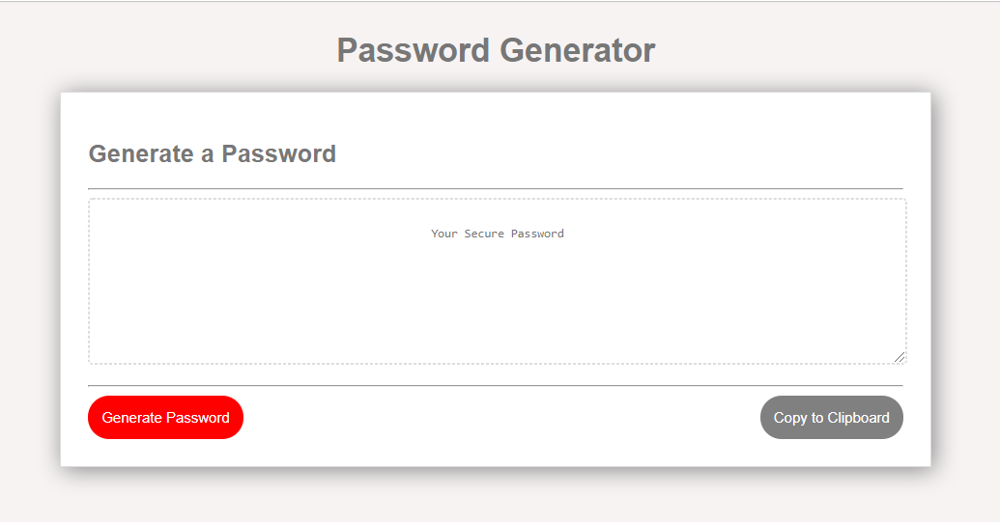
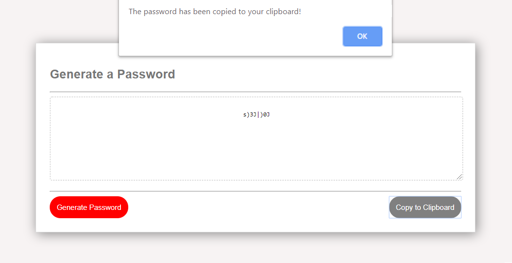

# Unit 03 JavaScript Homework: Password Generator

## Decription

This project was created to solve the security issues of weak passwords. Given that a user needs a new, secured password, they will be promted to determine certain character types required for the password and then a new random password will be generated.

The new password implements greater security to sensitive data and saves time for users.

The criteria that the password is able to meet are:  

1) the password is between 8 - 128 characters long, AND  

2) the password must have at least one of the following character types:  
    *lowercase characters  
    *uppercasse characters  
    *special characters  
    *numeric characters  

## The final product
 https://wendyhub.github.io/password-generator/

  
  

## Creator's notes

I found this assignment quite challenging. I had the concept/pseudo code in mind of what I wanted to achieve but there were flaws in my code along the way-- I particularly found it difficult to create a formula to generate the random code. Nonetheless I learned a lot from working on this project and am happy with the outcome.
